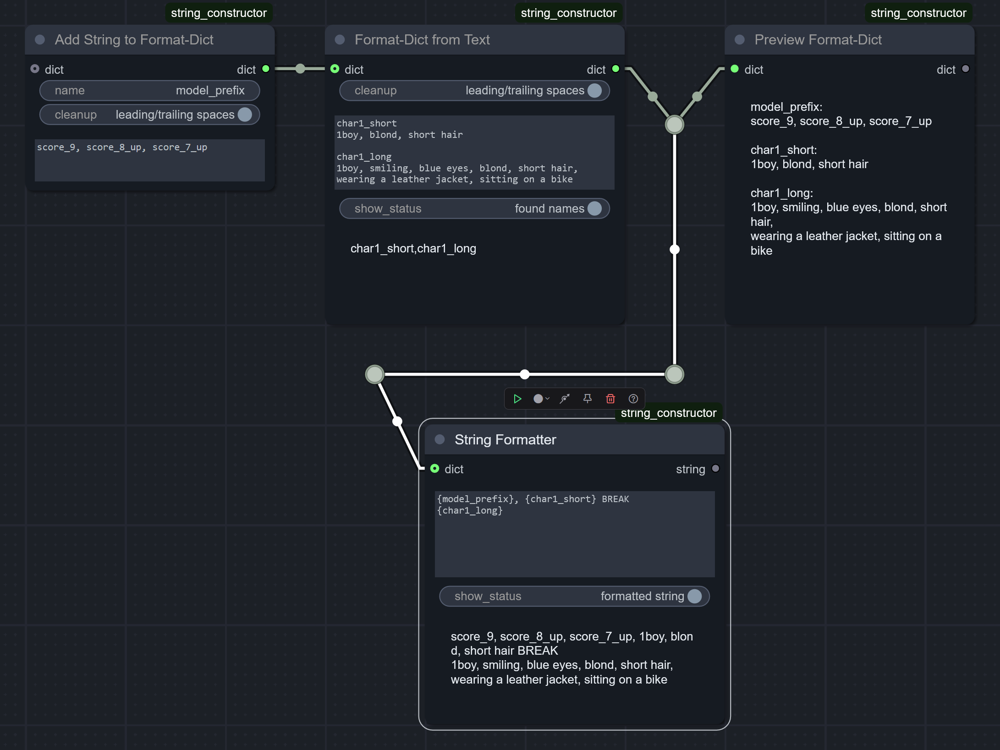
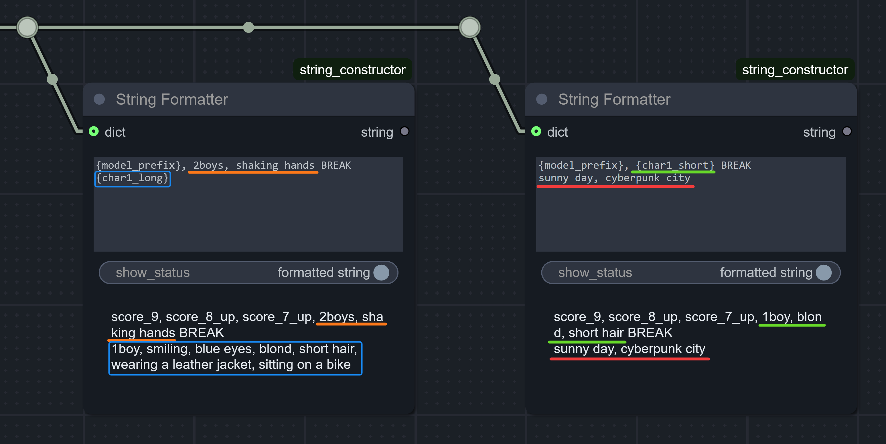

> "Do one thing and do it well." _— Peter H. Salus / Doug McIlroy, [core Unix principle](https://en.wikipedia.org/wiki/Unix_philosophy)_

> "Simple is better than complex." _— Zen of Python_

# `String Constructor` (Text-Formatting) nodes
... for ComfyUI.

[🔄 Updates ChangeLog](CHANGELOG.md)

### TL;DR

- Build your dictionary of available text chunks once. Pass it further as a single line (bus/pipe design).
- Easily reuse these sub-strings to build many variations of a prompt as needed.
- It's especially handy for regional prompting (aka area composition).
- ...
- PROFIT!

## The purpose of the pack

There's already a plenty of string-formatting nodes for ComfyUI. But this node pack takes a different approach:
- First, you **prepare** a dictionary of named sub-strings _(chunks of text with assigned keyword/tag to reference them with)_ - of whatever size you like:
  - it could be just two mostly used chunks, or it could be dozens of individual descriptions for highly narrow/specific parts of the subject - your choice!
- When constructing a text prompt, you can use **ANY** such sub-strings from the dict (or none at all), in **ANY** order you like, while connecting only a **SINGLE** bus/pipe-like input with the whole dictionary. No need to fiddle around connecting a bunch of wires every time you'd like to slightly rearrange the prompt, compiled from the same parts. There's just a single node, single input _(with all the available text pieces contained within it)_, single text field - and that's it.
  - This changes your workflow drastically. Since you can compose an entirely new prompt from the same dictionary with just one node, you're no longer pushed to reusing the same spaghetti of pre-encoded conditionings (for different parts of the prompt) - instead, you can just build a new conditioning in-place, right there, next to `KSampler`.
  - The text-compilation itself is done with python's [string formatting syntax](https://docs.python.org/3/library/string.html#format-examples) in its most native form... **Don't panic!** You don't need to be a programmer: this dictionary is basically just a bunch of "search and replace" rules wrapped into a single entity. Just look below for a quick introduction.
- You can easily update **some** items in the dict down the line - to tweak only relevant parts of the prompt, while preserving the rest of them.
- Unlike many other _(giant uber-mega)_ node packs, this one strictly adheres to the modular philosophy: it's minimal and self-sufficient. It's designed to only do string formatting and nothing else.

For example, in the screenshot shown above, this is the dictionary we get in the end (as the `Preview` node confirms):

| Chunk Name     | Chunk Text                                 |
|----------------|--------------------------------------------|
| `model_prefix` | <pre>score_9, score_8_up, score_7_up</pre> |
| `char1_short`  | <pre>1boy, blond, short hair</pre>         |
| `char1_long`   | <pre>1boy, smiling, blue eyes, blond, short hair,[NEW LINE HERE] sitting on a motorcycle, wearing a leather jacket</pre> |

And then, we can do **this** with the same input dictionary:

> [!IMPORTANT]
> The `BREAK` keyword shown here isn't natively supported by Comfy's `CLIP Text Encode`. But you can use [`CLIPTextEncode with BREAK syntax`](https://github.com/dfl/comfyui-clip-with-break) or [`CLIP Text Encode++` from smZNodes](https://github.com/shiimizu/ComfyUI_smZNodes) (if you want to fully switch from Comfy's to A1111's way of encoding text).

## String-Formatting syntax

To build an actual text from those pieces, we utilize string formatting with the corresponding node.

The rules are very simple:
- In the text-formatting node, you simply put your `{substring_name}` inside curly braces (no spaces between) - and voila! This pattern will be replaced with the actual sub-string.
  - For your convenience, the string-formatting node itself can show the actual output to avoid any guessing.
- Also keep in mind, that while naming your sub-strings, you must follow the same restrictions python imposes on any variable names: only ASCII letters, digits and underscore are allowed + the name can't start with a digit. So:
  - ✅ `valid_name`, `other_valid_name`, `YetAnother_ValidName`, `name4`.
  - ❌ `wrong name with spaces`, `wrong-name.with:punctuation`, `4name`.
  - Don't worry, the node pack will warn you if you type an invalid name.

> [!NOTE]
> For advanced users:
> Internally, just a built-in `str.format()` is called with keyword arguments from the passed Format-Dict, which is literally just a dict with string keys... though, all the nodes in the pack ensure they return it as an immutable one.
> 
> So any formatting patterns are available (like `{float_value:.3f}`) + `Add ANY to Format-Dict` node is there for exactly that.
