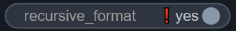
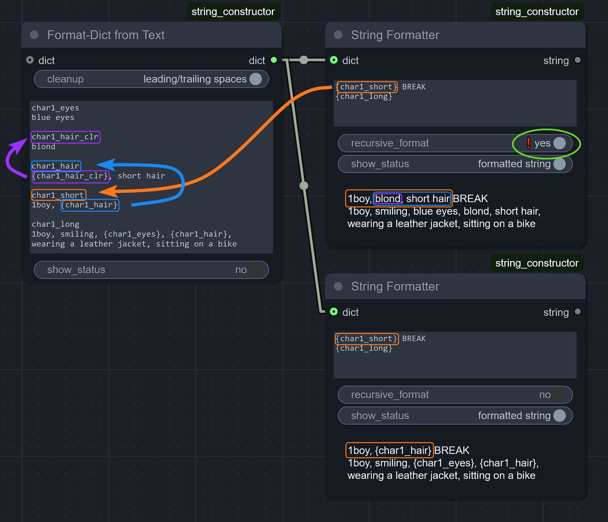
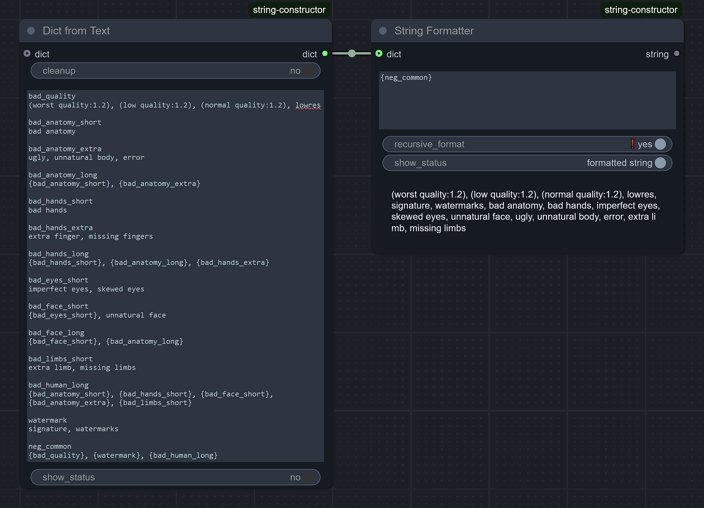

> "Do one thing and do it well." _— Peter H. Salus / Doug McIlroy, [core Unix principle](https://en.wikipedia.org/wiki/Unix_philosophy)_

> "Simple is better than complex." _— Zen of Python_

# `String Constructor` (Text-Formatting) nodes
... for ComfyUI.

[🔄 Updates ChangeLog](CHANGELOG.md)

### TL;DR

There's already a plenty of string-formatting nodes for ComfyUI. But this node pack takes a different approach:
- Build your dictionary of available text chunks once. Pass it further as a single line (bus/pipe design).
- Easily reuse these sub-strings to build as many variations of a prompt as needed.
- It's especially handy for regional prompting (aka area composition).
- [❗ Recursive formatting support](#recursive-formatting-)
- ...
- PROFIT!


## The main `String Formatter` node

It expects one input with a full "library" (dictionary) of all the named strings you might need, and it lets you use them in a prompt - any of them (or none at all), in any order, anywhere inside text template - using [python's string formatting syntax](https://docs.python.org/3/library/string.html#format-examples)... **Don't panic!** All the unfamiliar programming terms are explained below.

But the main point is, you don't need to fiddle around connecting a bunch of wires every time you'd like to build another prompt, compiled from the same parts. There's just a single node, single input _(with all the available text pieces contained within it)_, single text field - and that's it.

> [!NOTE]
> Unlike many other _(giant uber-mega)_ node packs, this one strictly adheres to the modular philosophy: it's minimal and self-sufficient. It's designed to only do string formatting and nothing else.

### Dictionary

For those unfamiliar, dictionary is a special datatype, which can contain a bunch of individual values (as many as you need), each of which accessible with its own **unique** name _(key)_. For our purposes, it can be understood as a simple "search & replace" table. So, you prepare a bunch of distinct parts of the prompt, you name them and then you can reference any of them individually.

For example, in the screenshot shown above, this is the dictionary we get in the end (as the `Preview` node confirms):

| Chunk Name (key) | Chunk Text (value)                         |
|------------------|--------------------------------------------|
| `model_prefix`   | <pre>score_9, score_8_up, score_7_up</pre> |
| `char1_short`    | <pre>1boy, blond, short hair</pre>         |
| `char1_long`     | <pre>1boy, smiling, blue eyes, blond, short hair,[NEW LINE HERE]<br>wearing a leather jacket, sitting on a bike</pre> |

And then, we can do **this** with the same input dictionary:


> [!NOTE]
> The `BREAK` keyword shown here isn't natively supported by Comfy's `CLIP Text Encode`. But you can use [`CLIPTextEncode with BREAK syntax`](https://github.com/dfl/comfyui-clip-with-break) or [`CLIP Text Encode++` from smZNodes](https://github.com/shiimizu/ComfyUI_smZNodes) (if you want to fully switch from Comfy's to A1111's way of encoding text).


### String-Formatting syntax

The way you "paste" values from the dictionary into your text template is called "string formatting". Its syntax is very simple:
- You just put your `{key_name}` inside curly braces (no spaces between) - and voila! When the prompt template gets formatted, this pattern will be replaced with the actual sub-string.
  - For your convenience, the string-formatting node itself can show the actual output.
- Also keep in mind, that while naming your sub-strings, you must follow the same restrictions python imposes on any variable names: only ASCII letters, digits and underscore are allowed + the name can't start with a digit. So:
  - ✅ `valid_name`, `_other_valid_name_`, `YetAnother_ValidName___`, `name4`.
  - ❌ `wrong name with spaces`, `wrong-name.with:punctuation`, `4name`.
  - Don't worry, the node pack will warn you if you type an invalid name.

### Recursive formatting 

It's quite simple in principle yet the most powerful feature of the pack.

When formatting the string, you can let chunks reference each other, which unlocks immense possibilities - like building entire **HIERARCHIES** of descriptions with various granularity (tailored for different resolutions) or even [conditional string formatting](#dynamic-pattern-aka-conditional-formatting) for the most advanced users.

- You can design your dict to be intended for updating down the line. Change some keys → get a different prompt with the same template (for example, a more detailed description of a character).
- Don't forget that with recursive formatting, [template itself could be a part of the dictionary](#pattern-as-part-of-the-dictionary), too!



> [!WARNING]
> Remember that with great power comes great responsibility!
> 
> With a sloppy use, you can create chunks that cross-reference each other in an infinite loop. The node will error out after reaching a high level of recursion (about 1k), so you're safe. But still, you've been warned!

## Helper nodes for Dictionaries

At this point it should be clear that most of the work would be done around preparing the dictionary to use.

The pack provides some utility nodes to build such dict:
- `Dict from Text` - **this node would be enough 99% of the time**. It parses a single wall of text and splits it into chunks at empty lines. The first line in each chunk is extracted as key, the rest of the chunk _(including any number of new lines, as long as they have some text)_ is the actual text of this chunk.
- `Add String to Dict` - similar, but adds only one entry. Useful when you need a value or a key of the dictionary entry to come as input connection from somewhere else.
- `Add ANY to Dict` similar, but for advanced formatting. It allows you to add not only a string, but literally anything (float, int, etc). The key still must follow the same restrictions.
- Any of these nodes can take another dictionary as input - then they extend/update it.
- `Extract String from Dict` - the opposite to `Add String to Dict`: extracts a single element. With these two nodes, you can extract a single string, modify it, and update the dict with the new version. Technically, the main `String Formatter` node can "extract" string, too - but this one is more compact.
- `Validate Dict` - a node that ensures that all the keys in the dictionary are named properly. Useful if you build the dictionary with nodes from other packs (see below) and want to ensure that everything is fine - before passing the dictionary down the line.

These bundled nodes should be enough to start your journey. If you need to do a more advanced stuff with dictionaries, you can look into other node packs specializing on exactly that. Good candidates are:
- [Basic Data Handling](https://github.com/StableLlama/ComfyUI-basic_data_handling)
- [Eugene's Nodes](https://github.com/JEONG-JIWOO/ComfyUI_Eugene_Nodes)
- [WAS Node Suite](https://github.com/ltdrdata/was-node-suite-comfyui). Note: this is a mega-pack, over-bloated to my taste. It has nodes to work with dictionaries, but also **A TON** of other unrelated stuff... and it's known to have dependencies conflicting with other custom nodes.

## Helper nodes for Preview

To debug the dictionary you build, there's a `Preview Dict` node.

You might also look into the built-in `Preview Any` node.

Alternatively, [Crystools](https://github.com/crystian/ComfyUI-Crystools) pack has a `🪛 Show any to JSON` node _(I highly recommend it)_, which produces a more readable output. Crystools pack isn't as bloated as WAS' one, but still, it's a multipurpose mega-pack, too.

## Advanced Topics

### Pattern as part of the dictionary

With [Recursive formatting](#recursive-formatting-), nothing stops you from putting the template itself into the dictionary, too. You can even have both your prompts there (positive/negative), and you unpack them with a couple of `String Formatter` nodes _(with their only text being something like `{pos_template}` / `{neg_template}`)_,  just before KSampler.

This single possibility can **drastically** change your approach to workflow creation. Since building a prompt for a specific KSampler becomes effectively free (with a properly configured dictionary) and string-formatting/text-encoding is almost free, too - you no longer need passing spaghetti of your pre-encoded conditionings all across your workflow. Instead, you just build them in-place by simply setting a couple of "special" keys to the desired toggle-like values, and pass only your all-in-one dictionary itself.

#### A negative prompt example



Try it yourself:

```
bad_quality
(worst quality:1.2), (low quality:1.2), (normal quality:1.2), lowres

bad_anatomy_short
bad anatomy

bad_anatomy_extra
ugly, unnatural body, error

bad_anatomy_long
{bad_anatomy_short}, {bad_anatomy_extra}

bad_hands_short
bad hands

bad_hands_extra
extra finger, missing fingers

bad_hands_long
{bad_hands_short}, {bad_anatomy_long}, {bad_hands_extra}

bad_eyes_short
imperfect eyes, skewed eyes

bad_face_short
{bad_eyes_short}, unnatural face

bad_face_long
{bad_face_short}, {bad_anatomy_long}

bad_limbs_short
extra limb, missing limbs

bad_human_long
{bad_anatomy_short}, {bad_hands_short}, {bad_face_short}, {bad_anatomy_extra}, {bad_limbs_short}

watermark
signature, watermarks

neg_common
{bad_quality}, {watermark}, {bad_human_long}
```

### When you need curly braces themselves

To have the literal curly-brace characters inside the **formatted** prompt, you need to "escape" them: whenever you need one, you type it twice (`'{{'` or `'}}'`). Then, after formatting, it will turn to `'{'` or `'}'`, respectively.

Keep in mind though, that with [Recursive formatting](#recursive-formatting-), any `{{text}}` will become `{text}` after very first iteration, and thus on the next one, it still will be treated as a placeholder to put a string with a `text` key into.

However, this might be exactly what you want for...

### Dynamic pattern aka conditional formatting

In other words, you build a prompt, where **keys themselves** are compiled from pieces. For example:
- Your main text template has {{character_`{active_char}`}} pattern somewhere inside it.
- You also have a string named `active_char` in your dict, which you simply set to a number.
- Also-also, you have strings named `character_1`, `character_2`, etc.
- Then, with recursive formatting, depending on just a **single** value you set the `active_char` element to, the following happens:
  - At the first iteration, `{{` in the beginning and `}}` in the end are treated as escaped ones, so they're simply replaced to `{` and `}`.
  - The middle `{active_char}` part, however, is treated as a real pattern to replace.
  - Thus, after the first iteration, `{{character_{active_char}}}` becomes `{character_1}`...
  - ... and in the next iteration, the actual value of `character_1` string is placed here instead.

Clearly, to take advantage of this approach, you need to build your dictionary very cautiously and precisely. But if you do so, you effectively get a way of building entire **logic trees**, represented as data (not as code), all self-contained inside a single dictionary, but still letting you generate a **completely** different prompt by changing values of one or two such "switcher" strings.

At this point, your imagination is your only limit.

### Implementation details for programmers

Internally, just a built-in `str.format_map()` is called with keyword arguments from the passed Format-Dict, which is literally just a dict _(and it's expected to have only string keys)_.

So any "complex" formatting patterns are available, too (like `{float_value:.3f}`). `Add ANY to Format-Dict` node is there for exactly that.
